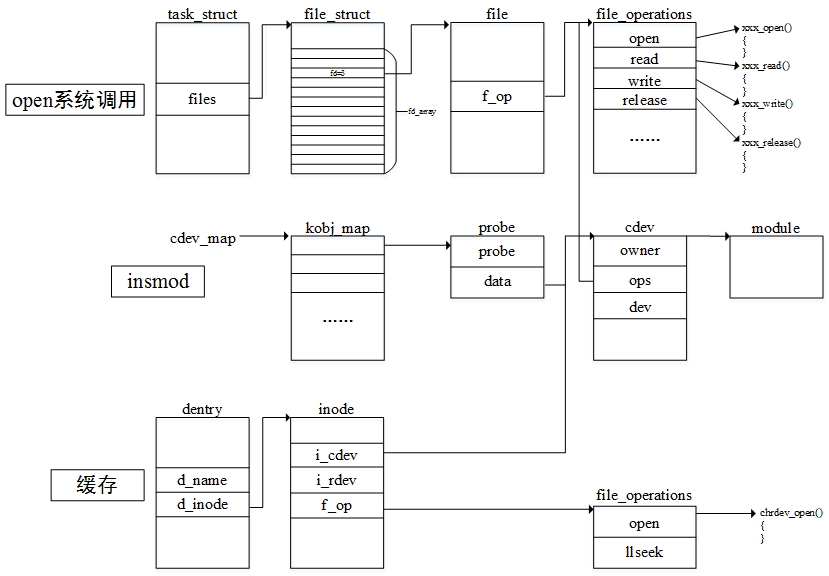

# About Linux Driver
### 内核模块

> Windows是微内核操作系统，微内核只是先内核中相当关键和核心的部分，其他功能模块被单独编译，功能模块之间的交互需要通过微内核提供的某种通信机制来建立。
>
> Linux是宏内核操作系统，所有的内核功能都被整体编译在一起，形成一个单独的内核镜像文件。其显著特点是效率非常高，内核中各功能模块是通过直接的函数调用来进行的。
>
> 为了方便驱动开发，Linux引入了内核模块，它是可以被单独编译的内核代码，可以在需要的时候动态加载到内核，从而动态地增加内核的功能。在不需要的时候可以动态地卸载，从而减少内核的功能，并节约一部分内存。内核模块的这一特点也有助于减小内核镜像文件的体积，自然也就减少了内核所占用的内存空间。

#### 最简单的内核模块

```c
#include <linux/init.h>//包含init_module和cleanup_module的函数原型声明
#include <linux/kernel.h>//包含printk函数原型的声明
#include <linux/module.h>//包含MODULE_LICENSE等宏定义

/* 模块初始化函数 */
static int __init simple_init(void){
    printk("module init\n");
    return 0;
}

/* 模块清理函数 */
static void __exit simple_exit(void){
    printk("cleanup module\n");
}

/* 为模块初始化函数和清理函数取别名 */
module_init(simple_init);
module_exit(simple_exit);

MODULE_LICENSE("GPL");
MODULE_AUTHOR("suda-morris <362953310@qq.com>");
MODULE_DESCRIPTION("A simple module");
MODULE_ALIAS("first_module");
```

* `MODULE_LICENSE`用来表征该模块接受的许可证协议，常见的有：GPL，GPL v2，Dual BSD/GPL，Dual MIT/GPL，Dual MPL/GPL等
* `MODULE_LICENSE`宏将会生成一些模块信息，放在ELF文件中的一个特殊的段中，模块在加载的时候会将该信息复制到内存中，并检查该信息。如果一个模块没有声明接受的许可协议，那么内核中的某些功能(API接口)是无法被调用的
* 模块的初始化函数(`init_module`)和清除函数(`cleanup_module`)的名字是固定的，但是借助于GNU的函数别名机制，可以灵活地指定模块的初始化函数和清除函数的别名
  * **module_init(初始化函数名)**
  * **module_exit(清除函数名)**
* 函数名可以任意指定会带来与内核中的已有的函数名冲突的可能，为了避免因为重名而带来的重复定义的问题，函数可以添加**static**关键字修饰
* 模块的初始化函数会且仅会被调用一次，在调用完成后，该函数不应该再次调用，所以该函数所占用的内存应该被释放掉，在函数名前加**__init**可以达到此目的。`__init`是把标记的函数放到ELF文件的特定代码段，在模块加载这些段时将会单独分配内存，这些函数调用成功后，模块的加载程序会释放这部分内存空间。`__exit`用于修饰清除函数，和`__init`的作用类似，但用于模块的卸载，如果模块不允许卸载，那么这段代码完全就不用加载

#### 内核模块Makefile模板

```makefile
ifeq ($(KERNELRELEASE),)

ifeq ($(ARCH),arm)
KERNELDIR ?= /home/morris/SUDA_V3S/kernel/linux-zero-4.13.y
ROOTSDIR ?= /home/morris/SUDA_V3S/rootfs/multistrap/rootfs
else
KERNELDIR ?= /lib/modules/$(shell uname -r)/build
endif

PWD ?= $(shell pwd)

modules:
	$(MAKE) -C $(KERNELDIR) M=$(PWD) modules
modules_install:
	$(MAKE) -C $(KERNELDIR) M=$(PWD) INSTALL_MOD_PATH=$(ROOTFS) modules_install
clean:
	rm -rf *.o *.ko .*.cmd *.mod.* modules.order Module.symvers .tmp_versions 

else

obj-m := simple.o
simple-objs = first_module.o

endif
```

* KERNELRELEASE是内核源码树中顶层Makefile文件中定义的一个变量，并对其赋值为Linux内核源码的版本，该变量会用export到处，从而可以在子Makefile中使用该变量
* 第一次解释执行该Makefile时，KERNELRELEASE没有被定义。KERNELDIR保存内核源码的路径，ROOTFSDIR保存根文件系统的路径
* Makefile的第一个目标是modules，执行模块编译的任务，仍然是对当前的Makefile使用make命令，其中增加的-C参数用来指定要进入的内核源码的目录，M变量保存内核源码树之外的目录(通常是额外的内核模块源码)。当编译过程折返回编译模块时(退出内核源码目录，再次进入模块目录，由M变量指定)，上述的Makefile将会第二次被解释执行，不过这是KERNELRELEASE变量已经被赋值，并且被导出，导致最开始ifeq条件不成立
* obj-m表示讲后面的目标编译成一个模块
* modules_install目标表示把编译之后的模块安装到指定目录，安装的目录为\$(INSTALL_MOD_PATH)/lib/modules/\$(KERNELRELEASE)，在没有对INSTALL_MOD_PATH赋值的情况下，模块将会被安装到/lib/modules/\$(KERNELRELEASE)目录下
* 上面的例子中，最终生成的模块为simple.ko，它由first_module等目标文件链接而成。这种Makefile格式适用于将一个或者多个源文件编译生成一个内核模块

#### 内核模块相关工具

1. 模块加载
   * insmod，加载指定目录下的.ko文件到内核
   * modprobe，自动加载模块到内核，前提条件是模块要执行安装操作，并且使用depmod命令来更新模块的依赖信息(使用modprobe无需指定路径和后缀)
2. 模块信息
   * modinfo，在安装了模块并运行depmod命令后，可以不指定路径和后缀；也可以指定查看某一特定.ko文件的模块信息
3. 模块卸载
   * rmmod，将指定的模块从内核中卸载
4. 生成模块依赖信息
   * depmod，生成模块的依赖信息，保存在/lib/modules/$(uname -r)/modules.dep文件中

#### 内核模块参数

> 模块参数允许用户在加载模块时通过命令行指定参数值，在模块加载过程中，加载程序会得到命令行参数，并转换成相应类型的值，然后赋值给对应的变量，这个过程发生在调用模块初始化函数之前。
>
> 内核支持的参数类型有：bool，invbool(反转值bool)，charp(字符串指针)，short，int，long，ushort，uint，ulong，这些类型又可以复合成对应的数组类型。

```c
#include <linux/init.h>//包含init_module和cleanup_module的函数原型声明
#include <linux/kernel.h>//包含printk函数原型的声明
#include <linux/module.h>//包含MODULE_LICENSE等宏定义

static int baudrate = 9600;
static int port[4] = {0,1,2,3};
static int port_num = sizeof(port)/sizeof(port[0]);
static char* name = "vser";

/* module_param(name,type,perm) */
module_param(baudrate,int,S_IRUGO);
module_param(name,charp,S_IRUGO);
/* module_param_array(name,type,nump,perm) */
module_param_array(port,int,&port_num,S_IRUGO);

/* 模块初始化函数 */
static int __init vser_init(void){
    int i;
    printk("vser_init");
    printk("baudrate:%d",baudrate);
    printk("port:");
    for(i=0;i<port_num;i++){
        printk("%d ",port[i]);
    }
    printk("name:%s",name);

    return 0;
}

/* 模块清理函数 */
static void __exit vser_exit(void){
    printk("vser_exit");
}

/* 为模块初始化函数和清理函数取别名 */
module_init(vser_init);
module_exit(vser_exit);

MODULE_LICENSE("GPL");
MODULE_AUTHOR("suda-morris <362953310@qq.com>");
MODULE_DESCRIPTION("A simple module");
MODULE_ALIAS("first_module");
```

* 模块加载到内核后，可以在sysfs文件系统中发现和模块参数对应的文件以及相应的权限`ls /sys/module/simple/parameters`

#### 内核模块依赖

> .ko文件是一个普通的ELF目标文件，使用nm命令查看模块目标文件的符号信息`nm simple.ko`
>
> ```shell
> 0000000000000020 d baudrate
> 0000000000000000 T cleanup_module
> 0000000000000000 T init_module
> 00000000000000d0 r __module_depends
> 0000000000000000 d name
>                  U param_array_ops
> 0000000000000020 r __param_arr_port
> 0000000000000050 r __param_baudrate
> 0000000000000028 r __param_name
>                  U param_ops_charp
>                  U param_ops_int
> 0000000000000000 r __param_port
> 0000000000000048 r __param_str_baudrate
> 0000000000000040 r __param_str_name
> 0000000000000000 r __param_str_port
> 0000000000000010 d port
> 0000000000000008 d port_num
>                  U printk
> 0000000000000000 D __this_module
> 0000000000000000 r __UNIQUE_ID_alias14
> 000000000000002f r __UNIQUE_ID_author12
> 0000000000000090 r __UNIQUE_ID_baudratetype8
> 0000000000000013 r __UNIQUE_ID_description13
> 0000000000000055 r __UNIQUE_ID_license11
> 00000000000000d9 r __UNIQUE_ID_name9
> 000000000000007c r __UNIQUE_ID_nametype9
> 0000000000000061 r __UNIQUE_ID_porttype10
> 00000000000000a8 r __UNIQUE_ID_srcversion10
> 00000000000000e5 r __UNIQUE_ID_vermagic8
> 0000000000000000 t vser_exit
> 0000000000000000 t vser_init
> ```
>
> vser_exit和vser_init的符号类型是t，表示它们是函数；而printk的符号类型是U，表示它们是一个未决符号，在编译阶段无法知道这个符号的地址，因为它被定义在其他文件中。
>
> 在printk的实现代码中(kernel/printk/printk.c)中，通过`EXPORT_SYMBOL(printkk)`宏将printk导出，其目的是为动态加载的模块提供printk的地址信息。
>
> **注意**：两个模块存在依赖关系，如果分别单独编译两个模块，这两个模块将无法加载成功。解决办法是将两个模块放在一起编译，或者将被依赖的模块集成到内核源码中编译。


### 设备驱动分类

1. 字符设备驱动

   > 设备对数据的处理是按照字节流的形式进行的，可以支持随机访问(比如帧缓存设备)，也可以不支持随机访问(比如串口)，因为数据流量通常不是很大，所以一般没有页高速缓存。

2. 块设备驱动

   > 设备对数据的处理是按照若干个块进行的，一个块有其固定的大小，比如硬盘的一个扇区通常是512字节，那么每次读写的数据至少就是512字节。这类设备通常都支持随机访问，并且为了提高效率，可以将之前用到的数据缓存起来，以便下次使用。

3. 网络设备驱动

   > 它是专门针对网络设备的一类驱动，其主要作用是进行网络数据的收发。


### 字符设备驱动基础

1. mknod命令

   > 在现在的Linux系统中，设备文件是自动创建的，即便如此，我们还是可以通过mknod命令来手动创建一个设备文件。mknod命令将文件名、文件类型和主次设备号等信息保存在了磁盘上。

2. 如何打开一个文件

   

   > 在内核中，一个进程用一个task_struct结构对象来表示，其中的files成员指向了一个files_struct结构变量，该结构体中有一个fd_array的指针数组(用于维护打开文件的信息)，数组的每一个元素是指向file结构的一个指针。open系统调用函数在内核中对应的函数是sys_open，sys_open调用了do_sys_open，在do_sys_open中首先调用getname函数将文件名从用户空间复制到内核空间。接着调用get_unused_fd_flags来获取一个未使用的文件描述符，要获得该描述符，其实就是搜索files_struct中的fd_array数组，查看哪一个元素没有被使用，然后**返回其下标**即可。接下来调用do_filp_open函数来构造一个file结构，并初始化里面的成员。其中最重要的是将它的f_op成员指向和设备对应的驱动程序的操作方法集合的结构file_operations，这个结构中的绝大多数成员都是函数指针，通过file_operations中的open函数指针可以调用驱动中实现的特定于设备的打开函数，从而完成打开的操作。do_filp_open函数执行成功后，调用fd_install函数，该函数将刚才得到的文件描述符作为访问fd_array数组的下标，让下标对应的元素指向新构造的file结构。最后系统调用返回到应用层，将刚才的数组下标作为打开文件的文件描述符返回。 
   >
   > do_filp_open函数是这个过程中最复杂的一部分，简单来说，如果用户是第一次打开一个文件，那么会从磁盘中获取之前使用mknod保存的节点信息(文件类型，设备号等)，将其保存到内存中的inode结构体中。另外，通过判断文件的类型，还将inode中的f_op指针指向了def_chr_fops，这个结构体中的open函数指向了chrdev_open，其完成的主要工作是：首先根据设备号找到添加在内核中代表字符设备的cdev(cdev是放在cdev_map散列表中的，驱动加载时会构造相应的cdev并添加到这个散列表中，并且在构造这个cdev时还实现了一个操作方法集合，由cdev的ops成员指向它)，找到对应的cdev后，用cdev关联的操作方法集合替代之前构造的file结构体中的操作方法集合，然后调用cdev所关联的操作方法集合中的打开函数，完成设备真正的打开函数。
   >
   > 为了下一次能够快速打开文件，内核在第一次打开一个文件或目录时都会创建一个dentry的目录项，它保存了文件名和所对应的inode信息，所有的dentry使用散列的方式存储在目录项高速缓存中，内核在打开文件时会先在这个高速缓存中查找相应的dentry，如果找到，则可以立即获取文件所对应的inode，否则就会在磁盘上获取。
   >
   > 可以说，**字符设备驱动的框架就是围绕着设备号、cdev和操作方法集合来实现的。**

3. 查看内核中已经安装的设备驱动:`cat /proc/devices`


### 字符设备驱动框架

> 要实现一个字符设备驱动，最重要的事就是**要构造一个cdev结构对象，并让cdev同设备号和设备的操作方法集合相关联，然后将该cdev结构对象添加到内核的cdev_mao散列表中**

```c
#include <linux/init.h>
#include <linux/kernel.h>
#include <linux/module.h>
#include <linux/fs.h>
#include <linux/cdev.h>
#include <linux/kfifo.h>

#define VSER_MAJOR      256
#define VSER_MINOR      0
#define VSER_DEV_CNT    1
#define VSER_DEV_NAME   "vser"

static struct cdev vsdev;
DEFINE_KFIFO(vsfifo,char,32);/* 定义并初始化一个内核FIFO，元素个数必须是2的幂 */

static int vser_open(struct inode* inode,struct file* filp){
    return 0;
}

static int vser_release(struct inode* inode,struct file* filp){
    return 0;
}

static ssize_t vser_read(struct file* filp,char __user* buf,size_t count,loff_t* pos){
    unsigned int copied = 0;
    /* 将内核FIFO中的数据取出，复制到用户空间 */
    int ret = kfifo_to_user(&vsfifo,buf,count,&copied);
    if(ret){
        return ret;
    }
    return copied;
}

static ssize_t vser_write(struct file* filp,const char __user* buf,size_t count,loff_t* pos){
    unsigned int copied = 0;
    /* 将用户空间的数据放入内核FIFO中 */
    int ret = kfifo_from_user(&vsfifo,buf,count,&copied);
    if(ret){
        return ret;
    }
    return copied;
}

static struct file_operations vser_ops = {
    .owner = THIS_MODULE,
    .open = vser_open,
    .release = vser_release,
    .read = vser_read,
    .write = vser_write,
};

/* 模块初始化函数 */
static int __init vser_init(void){
    int ret;
    dev_t dev;

    dev = MKDEV(VSER_MAJOR,VSER_MINOR);
    /* 向内核注册设备号，静态方式 */
    ret = register_chrdev_region(dev,VSER_DEV_CNT,VSER_DEV_NAME);
    if(ret){
        goto reg_err;
    }
    /* 初始化cdev对象，绑定ops */
    cdev_init(&vsdev,&vser_ops);
    vsdev.owner = THIS_MODULE;
    /* 添加到内核中的cdev_map散列表中 */
    ret = cdev_add(&vsdev,dev,VSER_DEV_CNT);
    if(ret){
        goto add_err;
    }
    return 0;

add_err:
    unregister_chrdev_region(dev,VSER_DEV_CNT);
reg_err:
    return ret;
}

/* 模块清理函数 */
static void __exit vser_exit(void){
    dev_t dev;
    dev = MKDEV(VSER_MAJOR,VSER_MINOR);
    cdev_del(&vsdev);
    unregister_chrdev_region(dev,VSER_DEV_CNT);
}

/* 为模块初始化函数和清理函数取别名 */
module_init(vser_init);
module_exit(vser_exit);

MODULE_LICENSE("GPL");
MODULE_AUTHOR("suda-morris <362953310@qq.com>");
MODULE_DESCRIPTION("A simple module");
MODULE_ALIAS("virtual-serial");
```

* **THIS_MODULE**是包含驱动的模块中的struct module类型对象的地址，类似于C++中的this指针，这样就能通过cdev或者fops找到对应的模块，在对前面两个对象访问时都要调用类似于try_module_get的函数增加模块的引用计数，因为在这两个对象使用的过程中，模块是不能被卸载的，模块被卸载的前提条件是引用计数为0


### 一个驱动支持多个设备

> 1. 首先要向内核注册多个设备号
> 2. 其次就是在添加cdev对象的时候指明该cdev对象管理了多个设备，或者添加多个cdev对象，每个cdev对象管理一个设备
> 3. 最麻烦的在于读写操作的时候区分对哪个设备进行操作。open接口中的inode形参中包含了对应设备的设备号以及所对应的cdev对象的地址。因此可以在open接口函数中读取这些信息，并存放在file结构体对象的某个成员中，再在读写的接口函数中获取该file结构的成员，从而可以区分出对哪个设备进行操作

#### 使用一个cdev实现对多个设备的支持

```c
#include <linux/init.h>
#include <linux/kernel.h>
#include <linux/module.h>
#include <linux/fs.h>
#include <linux/cdev.h>
#include <linux/kfifo.h>

#define VSER_MAJOR      256
#define VSER_MINOR      0
#define VSER_DEV_CNT    2   //本驱动支持两个设备
#define VSER_DEV_NAME   "vser"

static struct cdev vsdev;
DEFINE_KFIFO(vsfifo0,char,32);
DEFINE_KFIFO(vsfifo1,char,32);

static int vser_open(struct inode* inode,struct file* filp){
    /* 根据次设备号来区分具体的设备 */
    switch(MINOR(inode->i_rdev)){
        default:
        case 0:
            filp->private_data = &vsfifo0;
            break;
        case 1:
            filp->private_data = &vsfifo1;
            break;
    }
    return 0;
}

static int vser_release(struct inode* inode,struct file* filp){
    return 0;
}

static ssize_t vser_read(struct file* filp,char __user* buf,size_t count,loff_t* pos){
    unsigned int copied = 0;
    /* 将内核FIFO中的数据取出，复制到用户空间 */
    struct kfifo* vsfifo = filp->private_data;
    int ret = kfifo_to_user(vsfifo,buf,count,&copied);
    if(ret){
        return ret;
    }
    return copied;
}

static ssize_t vser_write(struct file* filp,const char __user* buf,size_t count,loff_t* pos){
    unsigned int copied = 0;
    /* 将用户空间的数据放入内核FIFO中 */
    struct kfifo* vsfifo = filp->private_data;
    int ret = kfifo_from_user(vsfifo,buf,count,&copied);
    if(ret){
        return ret;
    }
    return copied;
}

static struct file_operations vser_ops = {
    .owner = THIS_MODULE,
    .open = vser_open,
    .release = vser_release,
    .read = vser_read,
    .write = vser_write,
};

/* 模块初始化函数 */
static int __init vser_init(void){
    int ret;
    dev_t dev;

    dev = MKDEV(VSER_MAJOR,VSER_MINOR);
    /* 向内核注册设备号，静态方式 */
    ret = register_chrdev_region(dev,VSER_DEV_CNT,VSER_DEV_NAME);
    if(ret){
        goto reg_err;
    }
    /* 初始化cdev对象，绑定ops */
    cdev_init(&vsdev,&vser_ops);
    vsdev.owner = THIS_MODULE;
    /* 添加到内核中的cdev_map散列表中 */
    ret = cdev_add(&vsdev,dev,VSER_DEV_CNT);
    if(ret){
        goto add_err;
    }
    return 0;

add_err:
    unregister_chrdev_region(dev,VSER_DEV_CNT);
reg_err:
    return ret;
}

/* 模块清理函数 */
static void __exit vser_exit(void){
    dev_t dev;
    dev = MKDEV(VSER_MAJOR,VSER_MINOR);
    cdev_del(&vsdev);
    unregister_chrdev_region(dev,VSER_DEV_CNT);
}

/* 为模块初始化函数和清理函数取别名 */
module_init(vser_init);
module_exit(vser_exit);

MODULE_LICENSE("GPL");
MODULE_AUTHOR("suda-morris <362953310@qq.com>");
MODULE_DESCRIPTION("A simple module");
MODULE_ALIAS("virtual-serial");
```

#### 将每一个cdev对象对应到一个设备

```c

```

